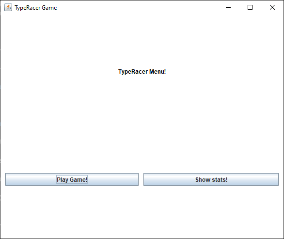

## User documentation
For compiling and running the program, see the initial `README.md` file. In short, the command `mvn compile exec:java` should work for running the game.

At first, the program will show the player the main menu.
The player may either start a new game or view their top scores.

The game consists of several components. The main components are the big textarea, where the text to be typed is displayed, and the small textarea, where the player types the text. The game is started by pressing the "Start!" button. The player than has a few seconds to prepare. The goal is to re-type the shown text (including punctuation and spaces) to the small textarea as fast as possible. The player may use the backspace key to correct mistakes. The game ends when the player has typed the text correctly. At the end of the game, measured metrics are displayed.

The text is black by default. The completed words are then shown in green color. If the player makes a mistake, all of the remaining words are shown in red (to notice it quickly).

The player may view their best scores in a table by pressing the "Show scores!" button in the main menu. The table is sorted by average WPM (words per minute) and shows the top 20 scores. It is possible to sort the table by other metrics by clicking on the column headers.

## Programming documentation

The program is written in Java 19. It was developed using the IntelliJ IDEA IDE, so for further development (especially in the GUI part), it is recommended to use the same IDE. The program uses Swing for the GUI and `org.json.json` library for working with JSON files.

The entire program is documented with Java comments. The JavaDoc documentation can be generated by running the command `mvn javadoc:javadoc` in the project's root directory. The generated documentation is located in the `target/site/apidocs` directory.

The repository contains one created package called `cz.lukaspolak.typeracer`. The package contains all of the game logic including all the classes.

There are the following classes in the package:
- `Constants.java` - contains all of the constants used in the program
- `Game.java` - contains the main game logic including the GUI
- `Main.java` - contains the main method for initializing the main menu
- `MainMenu.java` - contains the main menu including the GUI
- `Statistics.java` - contains everything related to the statistics including working with the files
- `StatisticsCriteria.java` - contains the statistics criteria for sorting the statistics table
- `StatsForm.java` - contains the statistics table including the GUI

### Potential extensions
This version of the game is very simple and there are many potential extensions. Some of them are listed below:
- add multiplayer mode
- add more texts to the game
- add more statistics
- compare player's statistics with the statistics of other players
- add more languages
- add various difficulty levels
- add better-looking graphic elements